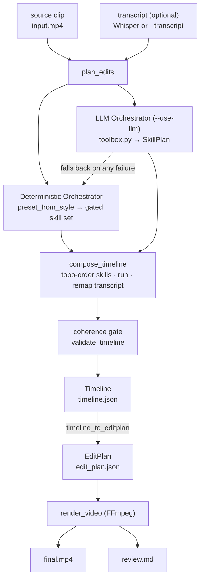
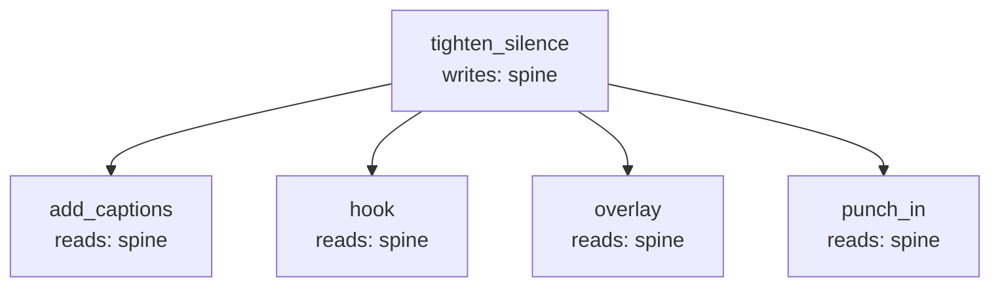

# shortform_lab

A **local talking-head enhancer**. Give it one short raw talking-head clip
(10–60s, mp4/mov, one person speaking to camera) and it produces a polished
vertical short-form video with a hook, readable captions, simple overlays, and
punch-in zooms.

This is a local content-polish engine, not a long-form clip finder. Everything
runs locally and is file-based. The pipeline produces an inspectable
`edit_plan.json` first, then renders `final.mp4` from that plan — so every
creative decision can be reviewed and replaced.

## Pipeline

```text
input video
  -> validate and probe media
  -> extract audio
  -> transcribe speech
  -> create edit plan
  -> render captions and overlays
  -> export final video
  -> write review report
```

## Architecture

**[Interactive architecture preview →](https://claude.ai/code/artifact/b30bb625-93db-4ddb-b82e-388387fdf563)**
(full write-up: [`docs/architecture.md`](docs/architecture.md))

The whole design rests on one rule: **agents decide, deterministic code
executes and verifies.** `plan_edits` branches exactly once — into a
`DeterministicOrchestrator` (no LLM, always available) or an `LLMOrchestrator`
(`--use-llm`, picks skills and parameters from a fixed toolbox, never a
timestamp or export setting, and falls back to the deterministic path on any
failure). Both converge on the same `compose_timeline` engine, the same
coherence gate, and the same renderer.



Skill run order is never hand-maintained — `compose_timeline` derives it from
each skill's declared `reads`/`writes`, so `tighten_silence` (the only writer
of the spine) always runs before every skill that reads it:



Invariants that always hold:

- Skills edit the Timeline only — nothing above the renderer touches FFmpeg or a pixel.
- The Timeline is validated before render; an invalid Timeline never reaches FFmpeg.
- The deterministic, offline path is the default; `--use-llm` is opt-in and always has a fallback.
- A disabled feature is absent from the Timeline entirely — the JSON, the logs, and the video always agree.
- `timeline.json` and `edit_plan.json` stay hand-editable and re-renderable.
- Timestamps are integer milliseconds everywhere in stored shapes — no float-seconds creep in.

## Requirements

- Python 3.12+
- [FFmpeg](https://ffmpeg.org/) (`ffmpeg` and `ffprobe` on your `PATH`)

## Install

```bash
uv sync
# optional: enable OpenAI transcription + LLM planning
uv sync --extra openai
cp .env.example .env   # then fill in OPENAI_API_KEY if using OpenAI
```

## Usage

```bash
python -m shortform_lab.cli process input.mp4 --style bold_creator
```

With a pre-existing transcript (runs with no API cost):

```bash
python -m shortform_lab.cli process input.mp4 --style bold_creator --transcript transcript.json
```

Each run creates a unique output folder:

```text
output/2026-05-29-<slug>/
  source.mp4
  audio.wav
  transcript.json
  edit_plan.json
  final.mp4
  review.md
```

## Styles

Creative behavior lives in YAML configs under `configs/styles/`, not in code.
Copy one to make your own — the renderer never hardcodes a creator style.

Shipped styles:

- `bold_creator`, `clean_captions` — sentence-level captions (`mode: sentence`).
- `word_pop`, `karaoke`, `one_word` — word-level animated captions
  (`mode: word`), one per animation.
- `reels_letterbox` — letterbox layout with word_pop captions in the bars.

### Layout (fill vs letterbox)

Layout is a separate axis from the caption look, so it composes with any style:

- `fill` (default) — scale to cover and center-crop to 9:16 (sides of a
  landscape source are cropped).
- `letterbox` — preserve the whole source, center it, and pad black bars; the
  hook moves into the top bar and captions into the bottom bar.

A style can set its default in YAML (`export.layout`), or override per run:

```bash
uv run python -m shortform_lab.cli process clip.mp4 --style word_pop --layout letterbox
uv run python -m shortform_lab.cli process clip.mp4 --style karaoke  --layout letterbox
```

### Word-level captions

Set `captions.mode: word` to get animated, word-by-word captions. The
`captions.word_animation` knob picks the look:

- `active_word` — a short word group stays on screen; the current word pops in
  the accent color (`highlight_color`). The classic short-form look.
- `karaoke` — a static group line; the accent color sweeps across words as they
  are spoken.
- `one_word` — one large centered word at a time.

Other word-mode knobs: `highlight_color` (`#RRGGBB`), `max_words_per_group`
(group size; `one_word` forces 1), and `uppercase`. Word timings come from the
transcriber when available (the OpenAI path requests them); for segment-only
transcripts they are evenly synthesized so the look still works offline.

### Tightening (silence/pause compression)

Off by default. When enabled, leading/trailing silence and long pauses between
speech are cut so the short is tighter. It composes with any style and layout:

```bash
uv run python -m shortform_lab.cli process clip.mp4 --style word_pop --tighten
uv run python -m shortform_lab.cli process clip.mp4 --tighten --layout letterbox --style karaoke
```

A style can also set it in YAML:

```yaml
tighten:
  enabled: true
  max_silence_ms: 350   # longest gap kept intact; longer gaps are cut
  pad_ms: 100           # breathing room kept around each retained phrase
```

The cut is recorded as `keep_ranges` (source-time spans) in `edit_plan.json` —
an **auditable cut list** you can inspect or hand-edit before re-rendering.
Everything else in the plan (captions, hook, punch-ins) is in the tightened
output timeline, so it stays in sync with `final.mp4`. v1 removes only silence;
no word or sentence is altered.

## Tests

```bash
uv run pytest
```

FFmpeg-dependent tests generate a tiny clip on the fly and skip automatically if
FFmpeg is not installed.

## Manual acceptance test

```bash
python -m shortform_lab.cli process samples/talking_head.mp4 --style bold_creator
```

Then open `output/<project_id>/final.mp4` and score it by eye:

```text
Would I post this?                          yes/no
Are captions readable?                      yes/no
Does the hook make sense?                   yes/no
Does the video feel better than the raw input?  yes/no
```

**Success criteria:** the generated video should be clearly more postable than
the raw input, even if it is not yet polished enough for a paid product.
